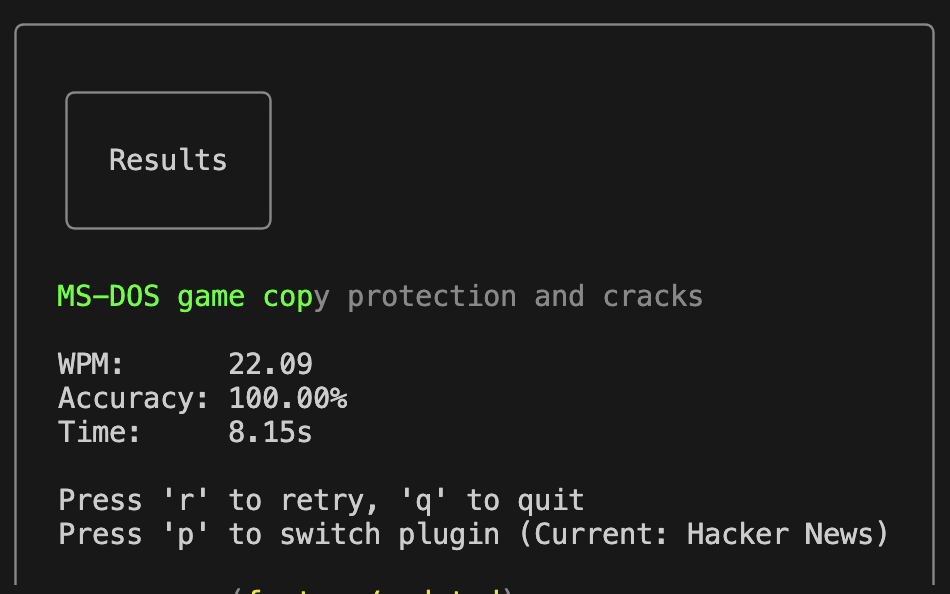

# Go-Racer

A CLI typing test tool written in Go.



## Features

- **Plugins**: Type titles from Hacker News or code from GitHub.
- **Strict Accuracy**: Only first-try correct characters count.
- **Persistence**: Remembers your last used plugin.
- **Shortcuts**:
  - `Option+Backspace` / `Ctrl+W`: Delete word.
  - `Esc`: Finish test early.
  - `p`: Switch plugin (in results).

## Installation

```bash
go install ./cmd/go-racer
```

This will install the `go-racer` binary to your `$GOPATH/bin` (usually `~/go/bin`). Ensure this directory is in your `$PATH`.

## Usage

```bash
go-racer
# or with specific plugin
go-racer -plugin spanish-news
```

## User Configuration

```~/.go-racer.json
{
  "last_plugin": "hn"
}
```
